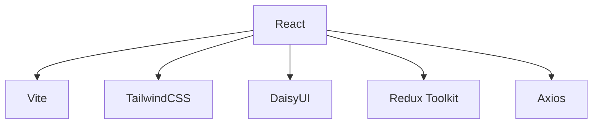

<p align="center">
  
</p>

<h1 align="center">👩‍💻 DevTinder</h1>
<p align="center">
  <b>Find your perfect dev match!</b><br>
  
  
  
  
  
</p>

---

## 🚀 Overview

DevTinder is a fun and interactive platform for developers to connect, collaborate, and grow together. Swipe through profiles, send requests, and build your network with ease!

---

## 🖼️ Features

- 🔐 **Authentication**: Login & Sign Up securely
- 📝 **Profile Editing**: Personalize your developer profile
- 📰 **Feed**: Discover new developers
- 🤝 **Connections**: View and manage your connections
- 📬 **Requests**: Accept or reject connection requests
- 🎨 **Modern UI**: Built with TailwindCSS & DaisyUI

---

## 🛠️ Tech Stack



---

## 📁 File Structure

DevTinder-Frontend/
├── public/
├── src/
│   ├── components/
│   ├── utils/
│   │   └── Redux/
│   ├── [App.jsx](http://_vscodecontentref_/1)
│   ├── [main.jsx](http://_vscodecontentref_/2)
│   └── [index.css](http://_vscodecontentref_/3)
├── [package.json](http://_vscodecontentref_/4)
├── [vite.config.js](http://_vscodecontentref_/5)
└── [README.md](http://_vscodecontentref_/6)

---

## 🏁 Getting Started

1. **Clone the repository**
   ```sh
   git clone https://github.com/yourusername/devtinder-frontend.git
   cd devtinder-frontend
   ```

2. **Install dependencies**
   ```sh
   npm install
   ```

3. **Start the development server**
   ```sh
   npm run dev
   ```

4. **Open [http://localhost:5173](http://localhost:5173) in your browser**

---


## 🤝 Contributing

Pull requests are welcome! For major changes, please open an issue first to discuss what you would like to change.

---

## 📄 License

This project is [MIT](LICENSE) licensed.

---

<p align="center">
  
</p>

